# Job Seer — Career Discovery & Application Acceleration Platform

> **Job Seer** is an end-to-end career acceleration and job search platform. It connects candidates with real-world opportunities through **live external job board aggregation**, **explainable 4-factor NLP match scoring**, **spatial coordinate PDF parsing**, **500+ skill taxonomy normalization**, **automated 10-layer ATS health diagnostics**, **human-in-the-loop factual gap verification**, **multi-template visual layout rendering**, and an **optimistic drag-and-drop Kanban application pipeline**.

---

## Executive Overview (For Recruiters & Hiring Managers)

In today's competitive job market, candidates face two systemic hurdles:
1. **The "Black Box" ATS**: Resumes are filtered out by automated Applicant Tracking Systems without candidates knowing why or where they fell short of the employer's criteria.
2. **Fragmented Workflows**: Job seekers juggle disparate job boards, disconnected document versions, generic cover letters, and manual spreadsheets to track their applications.

**Job Seer** resolves both challenges in a unified, accessible workspace that guides candidates through a continuous 5-stage career acceleration loop:

$$\text{DISCOVER} \longrightarrow \text{MATCH} \longrightarrow \text{PREPARE} \longrightarrow \text{APPLY} \longrightarrow \text{TRACK}$$

---

## Core Capabilities & Architectural Highlights

### 1. Spatial Coordinate PDF Parsing Engine
- **Physical Bounding Box Geometry**: Utilizes PyMuPDF (`fitz`) block coordinate tuples $(x_0, y_0, x_1, y_1)$ to inspect layout geometry on every uploaded document.
- **Dual-Column Canva Separation**: Automatically detects creative and multi-column resume layouts by analyzing horizontal block distribution across page boundaries ($x_1 \le 0.48 \times W$ vs. $x_0 \ge 0.40 \times W$).
- **Column-Aware Reading Order**: Processes multi-column resumes left-column top-to-bottom first, then right-column top-to-bottom, completely eliminating text interleaving between sidebar skills and chronological work history.
- **Discretionary Hyphenation Cleanup**: Automatically repairs soft hyphens (`\xad`), mid-word linebreaks, and inconsistent whitespace formatting.

### 2. 500+ Skill Taxonomy, Alias Graph & Context Disambiguation
- **Comprehensive Technical Taxonomy**: Extensively curated dictionary spanning 500+ specialized tools across 7 domains:
  - Programming Languages (`Python`, `TypeScript`, `Golang`, `Rust`, `C++`, `Java`, `Kotlin`, `Swift`, etc.)
  - Frontend Ecosystem (`React`, `Vue.js`, `Angular`, `Next.js`, `Svelte`, `Tailwind CSS`, etc.)
  - Backend & Distributed Systems (`FastAPI`, `Django`, `Node.js`, `Spring Boot`, `gRPC`, `GraphQL`, `Kafka`, `RabbitMQ`, etc.)
  - Cloud & DevOps Infrastructure (`AWS`, `GCP`, `Azure`, `Kubernetes`, `Docker`, `Terraform`, `CI/CD`, `Prometheus`, etc.)
  - Databases & Storage (`PostgreSQL`, `MongoDB`, `Redis`, `Cassandra`, `Elasticsearch`, `ClickHouse`, etc.)
  - Testing & Quality Engineering (`Pytest`, `Jest`, `Cypress`, `Playwright`, `Selenium`, etc.)
  - Data Science & Machine Learning (`PyTorch`, `TensorFlow`, `Pandas`, `NumPy`, `Scikit-Learn`, `Apache Spark`, etc.)
- **Normalized Alias Graph**: Bidirectional resolution mapping industry abbreviations to canonical forms (e.g., `k8s` -> `kubernetes`, `ts` -> `typescript`, `py` -> `python`, `node.js` -> `nodejs`, `postgres` -> `postgresql`).
- **Contextual Disambiguation Engine**: Eliminates false positives for short or ambiguous English words (`Go`, `C`, `R`, `Rust`, `Spring`) by requiring surrounding technical co-occurrence terms (e.g., `golang|goroutines|channels` for Go; `embedded|c\+\+|pointers` for C; `spring boot|spring framework|java` for Spring).

### 3. Live Global Job Board Aggregation (Adzuna Developer Integration)
- **Real-World Openings**: Real-time integration with the **Adzuna Global Job Exchange API** delivers live openings across the US, UK, Canada, Germany, Australia, and India.
- **Targeted Fallback Sync**: When syncing without explicit query filters, the platform defaults to the candidate's CV-extracted target role, preferred work arrangement, and core competencies.
- **Data Normalization Pipeline**: Cleans raw HTML descriptions, parses and normalizes salary bounds (`$min - $max` / `$avg`), detects remote vs. hybrid vs. on-site arrangements, and infers senior, mid-level, or junior experience levels.
- **Deduplication Engine**: Protects the database against duplicate records using composite external IDs and company/title signature hashing.

### 4. Explainable 4-Factor Fit Engine (Engine V2)
- **Deterministic Multi-Factor Scoring**: Computes an explainable composite fit score (0–100%):
  - **40% Technical Skills Overlap**: Normalized against the 500+ alias dictionary.
  - **30% Semantic Content Similarity**: TF-IDF vectorization with cosine similarity (`scikit-learn` + `spaCy`).
  - **15% Experience Level Calibration**: Calibrates candidate seniority against job requirements.
  - **15% Role Title Alignment**: Evaluates semantic proximity between target title and job opening.
- **Transparent Skill Breakdown**: Visually classifies matched competencies (green chips) and identifies missing qualifications (amber chips).

### 5. Human-in-the-Loop Factual Gap Verifier
- **Anti-Hallucination Philosophy**: Rejects synthetic fabrication of work achievements or fake percentage metrics.
- **Interactive Verification Matrix**: For every missing requirement, presents an interactive 4-option multiple choice selector:
  1. *Professional Experience*: Prompts for authentic company and production context.
  2. *Hands-on Projects*: Prompts for real personal or academic project applications.
  3. *Transferable Knowledge*: Maps adjacent conceptual mastery.
  4. *Open to Learn (Option 2)*: Formats a proactive, honest adaptability statement for summary and cover letter without fabricating false work history.
- **100% Grounded Tailoring**: Assembles interview-defensible CV versions anchored entirely to candidate-verified claims.

### 6. Multi-Template Visual Layout Studio (6 Archetypes)
- **Zero External Redirection**: Imports Canva resume layouts directly into native in-app rendering engines without third-party dependencies.
- **6 Distinct Design Archetypes**:
  - **Canva Data Analyst B&W**: High-contrast modern layout with structured competencies and progress indicators.
  - **Executive Serif**: Classic corporate aesthetic with refined typography for leadership roles.
  - **Modern Minimalist**: Clean, spacious layout prioritizing typography and white-space flow.
  - **Tech Linear**: Left accent border and monospaced tech tags for engineering roles.
  - **Academic Classic**: Dense, traditional format suited for research and publications.
  - **Modern Clean**: Balanced single-column ATS gold standard in Times New Roman 11pt, 1.5 line spacing.
- **Live In-App Customization**: Real-time accent color picker, inline click-to-edit sheet, and print-ready PDF export.

### 7. 10-Layer ATS Health Diagnostic Engine
- **Automated ATS Readiness Score (0–100)**: Evaluates uploaded resumes (`.pdf`, `.docx`, `.txt`) across 10 dimensions:
  - Header & Contact Presence (Email, Phone, LinkedIn, GitHub, Portfolio).
  - Essential Section Detection (Summary, Experience, Education, Skills, Projects).
  - Formatting & Structural Readability (Parsability and token length boundaries).
  - Action Verb Density (Measures impact verbs like *Architected*, *Implemented*, *Optimized*).
  - Filler Noise Filter (Identifies overused generic buzzwords).
  - Technical Skill Domain Categorization across 7 technical disciplines.

### 8. Application Pipeline & Kanban Workspace
- **Drag-and-Drop Workflow**: Organizes opportunities across 5 career stages:
  - `Not Applied` -> `Applied` -> `Interview` -> `Offer` -> `Rejected`
- **Optimistic UI with Rollback Safety**: Status movements update client-side state immediately and synchronize asynchronously; network anomalies trigger automatic rollback.
- **Milestone Date Logging**: Records applied dates, interview rounds, notes, and follow-up reminders.
- **Dual View**: Seamlessly switch between the visual Kanban Board and a high-density tabular List view.

---

## System Architecture & Technology Stack

Job Seer is built on a decoupled, asynchronous multi-tier architecture engineered for high throughput, sub-second NLP analysis, robust data integrity, and strict enterprise security standards.

```mermaid
graph TB
    subgraph ClientTier ["1. PRESENTATION LAYER (React 18 SPA)"]
        UI_Dashboard["Command Center & Metrics Analytics"]
        UI_JobsHub["Live Jobs Hub & Multi-Filter Discovery"]
        UI_ResumeHub["Resume Hub & 10-Layer Health Auditor"]
        UI_AtsPortal["ATS Portal & Multi-Template Studio (6 Archetypes)"]
        UI_GapVerifier["Human-in-the-Loop Factual Gap Verifier"]
        UI_Tracker["Optimistic Kanban Application Pipeline"]
        UI_Context["Persistent Theme (Light/Dark) & Auth Contexts"]
        UI_Axios["Axios Client (withCredentials Interceptor)"]
    end

    subgraph SecurityPerimeter ["2. SECURITY & GATEWAY PERIMETER"]
        SEC_CORS["Strict CORS Middleware (Whitelisted Origins)"]
        SEC_OWASP["OWASP Security Headers (nosniff, DENY, XSS, Referrer)"]
        SEC_RateLimit["Sliding-Window Client Rate Limiter"]
        SEC_AuthGuard["Dual Auth Guard (HttpOnly Cookies + Bearer JWT)"]
    end

    subgraph APITier ["3. API & ROUTING CONTROLLER LAYER (FastAPI)"]
        API_Auth["/auth - Session & Credentials Router"]
        API_Profile["/profile & /resume - Parsing & Profile Router"]
        API_Jobs["/jobs - Aggregation & Discovery Router"]
        API_Match["/matches - 4-Factor Fit Engine Router"]
        API_Tailor["/profile/tailor-resume - Grounded Tailoring Router"]
        API_Tracker["/applications - Kanban Pipeline Router"]
    end

    subgraph IntelligenceTier ["4. DETERMINISTIC NLP & PROCESSING ENGINES"]
        ENG_SpatialPDF["Spatial PDF Coordinate Parser (Bounding Box Geometry, Dual-Column Ordering)"]
        ENG_Taxonomy["500+ Skill Taxonomy & Context Disambiguation (Go, C, R, Rust, Spring)"]
        ENG_Adzuna["Adzuna Sync Worker (HTML Sanitation, Salary Normalization, Deduplication)"]
        ENG_MatchV2["4-Factor Fit Engine (TF-IDF Cosine, Skill Overlap, Role & Seniority Calibration)"]
        ENG_AtsAudit["10-Layer ATS Health Auditor (Completeness, Action Verbs, Noise Filter)"]
        ENG_Tailor["Grounded Tailor Engine (Candidate-Verified Claims, Option 2 Adaptability)"]
        ENG_CoverLetter["Multi-Tone Cover Letter Generator (Professional, Enthusiastic, Executive, Technical)"]
        ENG_Templates["Multi-Template Layout Engines (6 Archetypes, Times New Roman 11pt, Inline Edit)"]
    end

    subgraph PersistenceTier ["5. DATA PERSISTENCE & STORAGE LAYER"]
        ORM_SQLA["SQLAlchemy 2.0 ORM (Declarative Models & Connection Pooling)"]
        DB_Storage[("Relational Database - SQLite / PostgreSQL")]
        FS_Storage["Isolated Resume Storage (UUID Hashed File Hierarchy)"]
    end

    subgraph ExternalTier ["6. EXTERNAL ECOSYSTEM"]
        EXT_Adzuna["Adzuna Global Job Exchange REST API"]
        EXT_Employer["Official Employer Career Portals"]
    end

    %% Client to Security & API
    UI_Axios -->|Encrypted HTTPS Requests| SEC_CORS
    SEC_CORS --> SEC_OWASP
    SEC_OWASP --> SEC_RateLimit
    SEC_RateLimit --> SEC_AuthGuard
    SEC_AuthGuard --> API_Auth & API_Profile & API_Jobs & API_Match & API_Tailor & API_Tracker

    %% API to Intelligence
    API_Jobs --> ENG_Adzuna
    API_Profile --> ENG_SpatialPDF & ENG_AtsAudit & ENG_Templates
    API_Match --> ENG_MatchV2 & ENG_Taxonomy
    API_Tailor --> ENG_Tailor & ENG_CoverLetter & ENG_Taxonomy

    %% Intelligence to External
    ENG_Adzuna <-->|REST API Query / Rate-Limited Batching| EXT_Adzuna

    %% Persistence
    API_Auth & API_Tracker & ENG_Adzuna & ENG_Tailor & ENG_Templates --> ORM_SQLA
    ORM_SQLA --> DB_Storage
    API_Profile --> FS_Storage

    %% Direct Handoff
    UI_JobsHub & UI_Tracker & UI_AtsPortal -->|1-Click Direct Application Handoff| EXT_Employer
```



---

### Tiered Architecture Breakdown

#### 1. Presentation Layer (Frontend SPA)
* **Single-Page Application**: Built on **React 18.2** utilizing the **Vite** build engine for instantaneous hot-module replacement and minified production bundles.
* **Component Architecture**: Modular architecture separated into design primitives (`Card`, `Button`, `Badge`, `Input`, `Select`, `PageHeader`, `EmptyState`, `LoadingSkeleton`) and domain modules (`JobsHub`, `ResumeHub`, `AtsPortal`, `Tracker`, `Matches`, `Dashboard`).
* **State Management**: Reactive local state combined with shared context providers (`ThemeContext` for persistent light/dark themes, `AuthContext` for authentication state).
* **Communication & Resilience**: Centralized **Axios** client configured with request interceptors managing `withCredentials: true`, unified error formatting via `getApiErrorMessage()`, and graceful offline fallbacks.

#### 2. Security & Gateway Perimeter
* **OWASP Hardening Middleware**: Injects enterprise defense headers across all HTTP responses:
  * `X-Content-Type-Options: nosniff` (mitigates MIME-sniffing exploits)
  * `X-Frame-Options: DENY` (clickjacking mitigation)
  * `X-XSS-Protection: 1; mode=block` (cross-site scripting containment)
  * `Referrer-Policy: strict-origin-when-cross-origin`
* **Sliding-Window Rate Limiting**: In-memory sliding-window limiter enforcing strict request quotas on brute-force vulnerable endpoints (`POST /auth/login` restricted to 10 requests/minute per client IP) while guaranteeing high availability for general browsing.
* **Dual Authentication Strategy**: Verifies requests using either secure `HttpOnly`, `SameSite=Lax` session cookies or standard `Authorization: Bearer <token>` headers for third-party client interoperability.

#### 3. Core Application & Routing Layer (FastAPI)
* **Asynchronous Execution**: Native async route handlers run concurrently via `asyncio` and `uvicorn`, guaranteeing low-latency response times during compute-intensive NLP passes.
* **Schema Validation & Typing**: Strict request and response serialization powered by **Pydantic v2**, preventing malformed data ingestion, SQL injection, and parameter tampering.
* **Interactive API Documentation**: Auto-generates fully compliant OpenAPI v3 schemas accessible via `/docs` (Swagger UI) and `/redoc`.

#### 4. Deterministic NLP & Processing Subsystems
* **Spatial Coordinate PDF Parser**:
  * PyMuPDF bounding-box geometry `(x0, y0, x1, y1)` extraction.
  * Spatial column clustering resolving dual-column Canva resumes in natural reading order.
  * Hyphenation cleanup and character normalization.
* **500+ Skill Taxonomy & Disambiguation Engine**:
  * Curated taxonomy spanning 7 software domains.
  * Alias graph mapping hundreds of technical synonym pairs.
  * Regex co-occurrence disambiguation for single-letter and short terms (`Go`, `C`, `R`, `Rust`, `Spring`).
* **Engine V2 (Explainable 4-Factor Fit Scoring)**:
  * `scikit-learn` `TfidfVectorizer` and `cosine_similarity` for semantic text similarity.
  * `spaCy` NLP linguistic pipeline for tokenization and entity extraction.
  * 4-factor weighted score calculation (Skills 40%, Content 30%, Experience 15%, Role Title 15%).
* **10-Layer ATS Health Diagnostic Engine**:
  * Multi-dimensional scoring evaluating structural completeness, formatting noise, contact data presence, section boundaries, and action verb density.
* **Human-in-the-Loop Factual Gap Verifier & Tailoring Engine**:
  * Replaces synthetic metric generation with candidate-verified project context and Option 2 adaptability formatting.
* **Multi-Template Layout Studio**:
  * 6 visual layout archetypes supporting dynamic switching, inline click-to-edit, live accent color customizer, and browser-native PDF print formatting.

#### 5. Data Persistence & Schema Management Layer
* **Object-Relational Mapping**: **SQLAlchemy 2.0+** using declarative class mappings with explicit foreign key relationships, cascade configurations, and database indexes.
* **Dual Database Compatibility**: Runs natively on **SQLite** for development and automated test runs, and fully compatible with enterprise **PostgreSQL** in production.
* **Isolated File System Storage**: Uploaded resume files (`.pdf`, `.docx`, `.txt`) are hashed with server-generated UUIDs, validated for magic byte signatures, and stored in user-isolated directories preventing path traversal.

---

### Comprehensive Technology Stack Matrix

#### Client-Side Technologies (Frontend)

| Layer / Subsystem | Technology / Library | Version | Functional Purpose & Implementation |
|---|---|---|---|
| **Core UI Framework** | React | 18.2.0 | Declarative component UI engine managing view states and DOM reconciliation |
| **Build & Tooling** | Vite | 4.5.14 | Instant esbuild compilation, optimized rollup packaging, and hot reload |
| **Styling Framework** | Tailwind CSS | 3.4.1 | Utility-first responsive design tokens and CSS variables |
| **Layout & Animation** | Framer Motion | 10.16.4 | Animation engine for smooth UI transitions and disclosures |
| **Iconography** | Lucide React | 0.294.0 | Consistent, lightweight SVG icon set for data displays |
| **HTTP Transport** | Axios | 1.6.2 | Promise-based HTTP client with request/response security interceptors |
| **Routing** | React Router DOM | 6.20.0 | Client-side routing with authentication guards and layout wrappers |
| **Testing** | Vitest + Testing Library | 1.0.4 | Unit testing framework verifying UI components and interaction states |

#### Server-Side Technologies (Backend)

| Layer / Subsystem | Technology / Library | Version | Functional Purpose & Implementation |
|---|---|---|---|
| **Language Runtime** | Python | 3.11+ / 3.14 | Modern high-performance asynchronous runtime environment |
| **Web Framework** | FastAPI | 0.104.1 | Modern async web framework with automatic OpenAPI documentation |
| **ASGI Web Server** | Uvicorn | 0.24.0 | Lightning-fast ASGI web server implementation |
| **Data Validation** | Pydantic | 2.5.2 | Robust data parsing, validation, and JSON schema generation |
| **ORM Framework** | SQLAlchemy | 2.0.23 | Enterprise ORM supporting declarative schemas and connection pooling |
| **Password Hashing** | Passlib (Bcrypt) | 1.7.4 | Cryptographically secure salted password hashing |
| **JWT Cryptography** | Python-Jose | 3.3.0 | JSON Web Token encoding, signing, and verification |
| **Spatial PDF Extraction** | PyMuPDF (Fitz) | 1.23.8 | Coordinate-aware bounding-box text extraction from PDF resumes |
| **Word Extraction** | docx2txt | 0.8 | Structured text extraction from Microsoft Word (`.docx`) documents |
| **HTTP Queries** | Requests / Urllib3 | 2.31.0 | External service queries to the Adzuna Global Job API |

#### NLP & Computational Subsystems

| Module | Algorithm / Package | Scope | Key Functional Mechanism |
|---|---|---|---|
| **Spatial Parser** | PyMuPDF Bounding-Box Geometry | Coordinate Parsing | Left/right column coordinate sorting eliminating dual-column text interleaving |
| **Linguistic Parser** | spaCy (`en_core_web_sm`) | Text Tokenization | Part-of-speech tagging, tokenization, and sentence boundary detection |
| **Vector Space Engine** | scikit-learn (`TfidfVectorizer`) | Document Similarity | Term frequency-inverse document frequency text vectorization |
| **Proximity Scoring** | scikit-learn (`cosine_similarity`) | Fit Scoring | Geometric cosine angle calculation between resume and job vectors |
| **Skill Taxonomy Engine**| Regex + Normalized Alias Graph | 500+ Skills Extraction | Alias graph normalization with regex co-occurrence disambiguation |
| **Document Diffing** | Python `difflib` | Version Comparisons | Unified sequence matcher generating highlighted line additions and deletions |

#### Security & Quality Assurance Specifications

| Security Vector | Implementation Mechanism | Validation Standard |
|---|---|---|
| **Session Protection** | Dual HttpOnly Cookies + Bearer JWT | Cross-Site Scripting (XSS) proof session storage |
| **CORS Governance** | Strict origin whitelisting | Blocks unauthorized cross-domain browser API invocations |
| **Denial of Service** | Sliding-window client IP limiter | Caps aggressive automated attacks on sensitive routes |
| **File Injection Defense** | Magic-byte signature inspection | Rejects renamed executables and enforces maximum size boundaries |
| **Path Traversal Defense**| Server-side UUID4 filename assignment | Prohibits relative path overrides (`../`) |
| **SQL Injection Defense** | Parameterized SQLAlchemy query binding | Guarantees zero unescaped user string interpolation in database queries |

---

## Testing & Code Quality Metrics

Every layer of the system is verified with an automated end-to-end test suite:

```bash
# Backend Automated Suite (197 tests passing)
cd backend
./venv/bin/pytest tests/ -v

# Run targeted spatial parser, taxonomy, precision & template tests
./venv/bin/pytest tests/test_spatial_pdf_parser.py tests/test_skill_taxonomy.py tests/test_extraction_precision.py tests/test_resume_templates.py -v

# Frontend Unit Tests
cd frontend
npm test

# Production Build Validation
cd frontend
npm run build
```

| Component / Test Suite | Test Metric | Status |
|---|---|---|
| **Full Backend Test Suite** | **197 / 197 Passed (100%)** | Passed (100%) |
| **Spatial PDF Coordinate Parsing Tests** | **4 / 4 Passed (100%)** | Passed (100%) |
| **Expanded Skill Taxonomy & Disambiguation** | **6 / 6 Passed (100%)** | Passed (100%) |
| **Extraction Precision & Golden Benchmarks** | **Recall >= 90%, ATS Health >= 80%** | Passed (100%) |
| **External Job Ingestion Tests** | **6 / 6 Passed (100%)** | Passed (100%) |
| **Canva Template & ATS Studio Tests** | **6 / 6 Passed (100%)** | Passed (100%) |
| **Security & Rate Limiting Tests** | **12 / 12 Passed (100%)** | Passed (100%) |
| **Frontend Unit Tests** | **6 / 6 Passed (100%)** | Passed (100%) |
| **Vite Production Bundle** | **0 Errors, 0 Warnings** | Optimized |

---

## Quickstart Guide

### Prerequisites
- Python 3.11 or higher
- Node.js 18+ and npm
- Free [Adzuna Developer Account](https://developer.adzuna.com/) (App ID & App Key)

### 1. Backend Setup
```bash
cd backend

# Create virtual environment
python3 -m venv venv
source venv/bin/activate  # On Windows: venv\Scripts\activate

# Install dependencies
pip install -r requirements.txt

# Download spaCy NLP model
python -m spacy download en_core_web_sm

# Configure environment variables
cp .env.example .env
# Edit .env with your credentials:
# ADZUNA_APP_ID=your_app_id
# ADZUNA_APP_KEY=your_app_key
# SECRET_KEY=your_secure_jwt_secret

# Start FastAPI server
uvicorn app.main:app --reload --port 8000
```
Backend will be live at `http://localhost:8000` (API Docs at `http://localhost:8000/docs`).

### 2. Frontend Setup
```bash
cd frontend

# Install dependencies
npm install

# Start Vite development server
npm run dev
```
Frontend will be live at `http://localhost:3000` (or `3001`).

---

## Repository Structure

```
Smart-Job-Hunter/
├── backend/
│   ├── app/
│   │   ├── core/           # Centralized configuration (Settings, Security)
│   │   ├── models/         # SQLAlchemy models (User, Profile, Job, ApplicationTracker, etc.)
│   │   ├── routers/        # FastAPI API routers (auth, jobs, matching, profile, applications)
│   │   ├── schemas/        # Pydantic v2 schemas and validation models
│   │   ├── services/       # Domain business logic (SpatialPdfParser, ExternalJobService, TailorService)
│   │   ├── utils/          # NLP utilities, MatchingEngine, ATS health scoring
│   │   ├── auth.py         # JWT and password authentication helpers
│   │   ├── database.py     # SQLite/Postgres engine, session management & migrations
│   │   └── main.py         # Application factory, middleware & router mounts
│   └── tests/              # 197 automated pytest test suites
│
├── frontend/
│   ├── src/
│   │   ├── components/     # UI design system components (Button, Card, Badge, Modal, etc.)
│   │   ├── context/        # ThemeContext (Persistent Dark/Light mode) & AuthContext
│   │   ├── pages/          # Full page views (Dashboard, JobsHub, Matches, ResumeHub, AtsPortal, Tracker, Login)
│   │   └── services/       # Axios API client & error mapping
│   └── package.json
│
└── README.md
```
