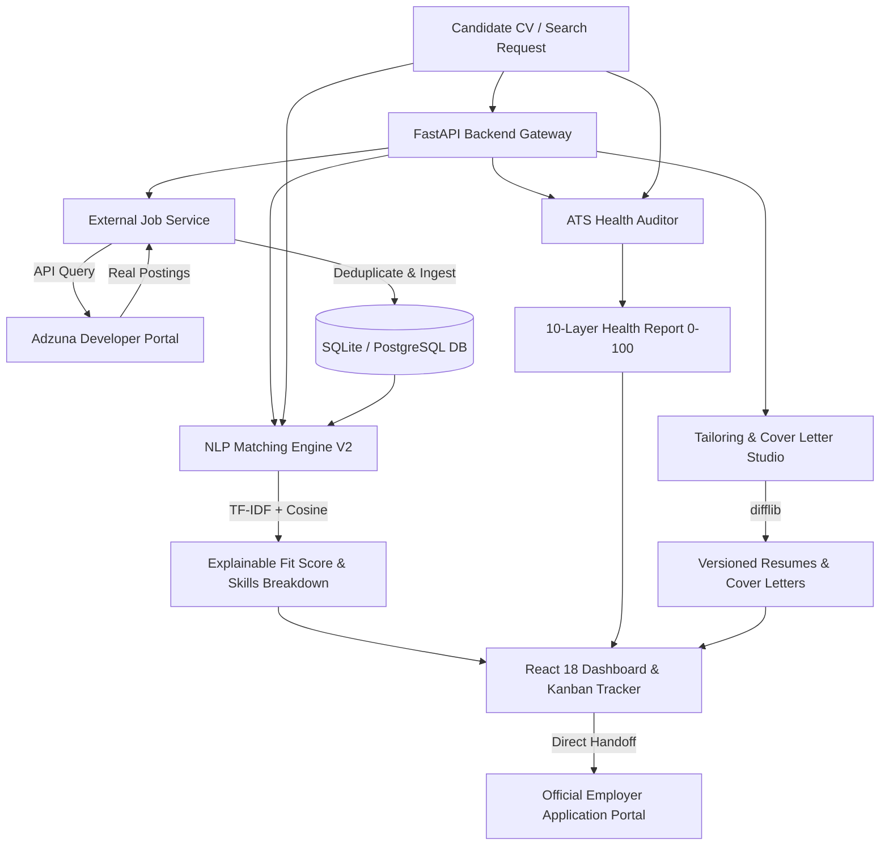

# Job Seer — Intelligent Career Discovery & Application Platform

> **Job Seer** is an end-to-end intelligent job search companion and career acceleration platform. It bridges the gap between candidates and real-world opportunities through **live external job board aggregation**, **explainable multi-vector NLP match scoring**, **automated 10-layer ATS health diagnostics**, **versioned resume tailoring with diff analysis**, and a **drag-and-drop Kanban application pipeline**.

---

## Executive Overview (For Recruiters & Hiring Managers)

In today's competitive job market, candidates face two systemic hurdles:
1. **The "Black Box" ATS**: Resumes are filtered out by automated Applicant Tracking Systems without candidates knowing why or where they fell short of the employer's criteria.
2. **Fragmented Workflows**: Job seekers juggle disparate job boards, disconnected document versions, generic cover letters, and manual spreadsheets to track their applications.

**Job Seer** resolves both challenges in a unified, accessible workspace that guides candidates through a continuous 5-stage career acceleration loop:
$$\text{DISCOVER} \longrightarrow \text{MATCH} \longrightarrow \text{PREPARE} \longrightarrow \text{APPLY} \longrightarrow \text{TRACK}$$

---

## Core Capabilities & Architectural Highlights

### 1. Live Global Job Board Aggregation (Adzuna Developer Integration)
- **Real-World Openings**: Real-time integration with the **Adzuna Global Job Exchange API** replaces static mock data with live openings across the US, UK, Canada, Germany, Australia, and India.
- **Smart Candidate Fallback**: When syncing without explicit filters, the system automatically uses the candidate's CV-extracted target role, preferred work mode, and core competencies.
- **Data Normalization Pipeline**: Cleans raw HTML descriptions, parses and normalizes salary bounds (`$min - $max` / `$avg`), detects remote vs. hybrid vs. on-site arrangements, and infers senior, mid-level, or junior experience levels.
- **Automated Skill Ingestion**: Parses incoming job descriptions using NLP keyword matchers and tokenizes technical skills into normalized domain tags.
- **Deduplication Engine**: Protects the database against duplicate records using composite external IDs and company/title signature hashing.

### 2. Explainable Resume-Job Fit Intelligence (Engine V2)
- **Multi-Factor Weighted Scoring**: Rather than a naive keyword count, our V2 Matching Engine computes an explainable composite fit score (0–100%):
  - **40% Technical Skills Overlap**: Normalized against synonym dictionaries (e.g., *React.js* = *React*, *PostgreSQL* = *Postgres*).
  - **30% Semantic Content Similarity**: TF-IDF vectorization with cosine similarity (`scikit-learn` + `spaCy`).
  - **15% Experience Level Calibration**: Penalizes seniority mismatches while rewarding qualified experience.
  - **15% Role Title Alignment**: Evaluates semantic role proximity (e.g., *Frontend Engineer* vs. *Full Stack Developer*).
- **Transparent Rationale & Skill Breakdown**: Visually classifies matched competencies (green chips) and identifies critical skill gaps (amber chips), empowering candidates to address missing qualifications before applying.

### 3. 10-Layer ATS Health Diagnostic Engine
- **Automated ATS Readiness Score (0–100)**: Evaluates uploaded resumes (`.pdf`, `.docx`, `.txt`) across 10 critical ATS dimensions:
  - Header & Contact Presence (Email, Phone, LinkedIn, GitHub, Portfolio).
  - Essential Section Detection (Summary, Experience, Education, Skills, Projects).
  - Formatting & Structural Readability (Parsability and length checks).
  - Action Verb Density (Measures impactful verbs like *Architected*, *Implemented*, *Optimized*).
  - Buzzword Penalty Filter (Identifies overused filler terms).
  - Technical Skill Domain Categorization across 7 disciplines (`languages`, `frontend`, `backend`, `databases`, `cloud_devops`, `data_ai`, `other`).

### 4. Factual CV Tailoring & Multi-Tone Cover Letter Studio
- **Versioned Tailored Resumes**: Automatically creates targeted, job-specific CV versions (`v1`, `v2`, `v3`) emphasizing the exact competencies required by the employer without fabricating experience.
- **Line-by-Line Visual Diff Viewer**: Integrated `difflib` comparison modal displaying highlighted additions, removals, and unchanged lines.
- **4-Tone Cover Letter Generator**: Generates customized cover letters calibrated to distinct workplace cultures:
  - `Professional` (Standard corporate & enterprise)
  - `Enthusiastic` (Fast-paced startups & high-growth teams)
  - `Executive` (Leadership, strategy & organizational impact)
  - `Technical` (Architecture, system design & engineering depth)
- **Direct Application Handoff**: Candidates are directed toward submitting their application with a 1-click **"Apply on Official Site"** button (linking directly to the employer's portal via Adzuna redirect links), **"Copy Materials"** buttons, and instant Kanban tracking.

### 5. In-System Canva Template Importer & ATS Standard Studio
- **Zero External Redirection**: Candidates can paste any Canva resume template link directly into the system. The platform imports and maps the design archetype into an in-app native engine without redirecting to Canva.
- **Automated CV Auto-Population**: Automatically injects and formats the candidate's structured resume content (Header, Summary, Skills, Experience, Education) into the template.
- **Recruiter Gold-Standard Typography**: Enforces the single-column ATS corporate standard in **Times New Roman, 11pt font, 1.5 line spacing** for 100% parser compatibility.
- **Live In-App Editing & PDF Export**: Candidates can edit text blocks inline on the document sheet, customize accent colors, save versioned drafts to the database, and download the finished CV as a PDF directly from the system.

### 6. Application Pipeline & Kanban Workspace
- **Drag-and-Drop Workflow**: Organizes opportunities across 5 career stages:
  - `Not Applied` -> `Applied` -> `Interview` -> `Offer` -> `Rejected`
- **Optimistic UI with Rollback Safety**: Status movements immediately update client-side state and asynchronously sync with the backend; any network failure safely rolls back the card to its previous column.
- **Milestone Date Logging**: Records applied dates, interview rounds, and follow-up reminders.
- **Dual View**: Seamlessly switch between the visual Kanban Board and a high-density tabular List view.

### 7. Modern Glassmorphic UI & Dual Theme System
- Built with Vanilla CSS design tokens and Tailwind CSS.
- **Persistent Theme Toggle**: Seamless light and dark mode with localStorage persistence.
- High-contrast, vibrant light mode with rich typography and micro-animations via Framer Motion.
- Fully responsive across mobile (360px) to ultra-wide displays (1440px+).

---

## System Architecture & Technology Stack



### Backend Architecture
- **Language & Runtime**: Python 3.11+ / 3.14 compatible
- **API Framework**: **FastAPI** (Asynchronous endpoints, automatic OpenAPI / Swagger documentation)
- **ORM & Database**: **SQLAlchemy 2.0+** with SQLite / PostgreSQL support
- **NLP & Text Analysis**:
  - `spaCy` (`en_core_web_sm`) for tokenization and entity recognition
  - `scikit-learn` (`TfidfVectorizer`) for content vectorization and cosine similarity
  - `PyMuPDF` (`fitz`) and `docx2txt` for resilient document parsing
- **Security & Auth**:
  - `python-jose` (JWT Access Tokens) + `passlib` / `bcrypt` (Salted password hashing)
  - Dual authentication: `HttpOnly`, `SameSite=Lax` cookies with Bearer token fallback
  - Custom sliding-window in-memory `RateLimiter` protecting login and sensitive endpoints
  - Full OWASP compliance: Content-Security headers (`X-Content-Type-Options: nosniff`, `X-Frame-Options: DENY`, `X-XSS-Protection`)

### Frontend Architecture
- **Framework**: **React 18.2** (Vite build tool)
- **Styling**: Tailwind CSS + Custom Design System tokens
- **Animations**: `framer-motion` for physics-based layout transitions and smooth accordion disclosures
- **Icons**: `lucide-react`
- **HTTP Client**: Axios with centralized request/response error interceptors and `withCredentials: true`

---

## Testing & Code Quality Metrics

Every layer of the system is tested with automated test suites:

```bash
# Backend Automated Suite (177 tests passing)
cd backend
./venv/bin/pytest tests/ -v

# Run targeted external job sync & tailoring tests
./venv/bin/pytest tests/test_external_job_sync.py tests/test_tailored_resume.py -v

# Frontend Unit Tests
cd frontend
npm test

# Production Build Validation
cd frontend
npm run build
```

| Component | Metric | Status |
|---|---|---|
| **Backend Test Suite** | **177 / 177 Passed (100%)** | Passed (100%) |
| **External Job Ingestion Tests** | **6 / 6 Passed (100%)** | Passed (100%) |
| **Security & Rate Limiting Tests** | **12 / 12 Passed (100%)** | Passed (100%) |
| **Frontend Unit Tests** | **6 / 6 Passed (100%)** | Passed (100%) |
| **Vite Production Bundle** | **0 Errors, 0 Warnings** | Optimized |

---

## Quickstart Guide

### Prerequisites
- Python 3.11 or higher
- Node.js 18+ and npm
- Free [Adzuna Developer Account](https://developer.adzuna.com/) (App ID & App Key)

### 1. Backend Setup
```bash
cd backend

# Create virtual environment
python3 -m venv venv
source venv/bin/activate  # On Windows: venv\Scripts\activate

# Install dependencies
pip install -r requirements.txt

# Download spaCy NLP model
python -m spacy download en_core_web_sm

# Configure environment variables
cp .env.example .env
# Edit .env with your credentials:
# ADZUNA_APP_ID=your_app_id
# ADZUNA_APP_KEY=your_app_key
# SECRET_KEY=your_secure_jwt_secret

# Start FastAPI server
uvicorn app.main:app --reload --port 8000
```
Backend will be live at `http://localhost:8000` (API Docs at `http://localhost:8000/docs`).

### 2. Frontend Setup
```bash
cd frontend

# Install dependencies
npm install

# Start Vite development server
npm run dev
```
Frontend will be live at `http://localhost:3000` (or `3001`).

---

## Repository Structure

```
Smart-Job-Hunter/
├── backend/
│   ├── app/
│   │   ├── core/           # Centralized configuration (Settings, Security)
│   │   ├── models/         # SQLAlchemy models (User, Profile, Job, ApplicationTracker, etc.)
│   │   ├── routers/        # FastAPI API routers (auth, jobs, matching, profile, applications)
│   │   ├── schemas/        # Pydantic v2 schemas and validation models
│   │   ├── services/       # Domain business logic (ExternalJobService, JobService, TailorService)
│   │   ├── utils/          # NLP utilities, MatchingEngine, ATS health scoring
│   │   ├── auth.py         # JWT and password authentication helpers
│   │   ├── database.py     # SQLite/Postgres engine, session management & migrations
│   │   └── main.py         # Application factory, middleware & router mounts
│   └── tests/              # 183 automated pytest test suites
│
├── frontend/
│   ├── src/
│   │   ├── components/     # UI design system components (Button, Card, Badge, Modal, etc.)
│   │   ├── context/        # ThemeContext (Persistent Dark/Light mode)
│   │   ├── pages/          # Full page views (Dashboard, JobsHub, Matches, ResumeHub, Tracker, Login)
│   │   └── services/       # Axios API client & error mapping
│   └── package.json
│
└── README.md
```

