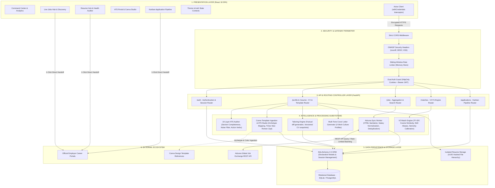

# Job Seer — Intelligent Career Discovery & Application Platform

> **Job Seer** is an end-to-end intelligent job search companion and career acceleration platform. It bridges the gap between candidates and real-world opportunities through **live external job board aggregation**, **explainable multi-vector NLP match scoring**, **automated 10-layer ATS health diagnostics**, **versioned resume tailoring with diff analysis**, and a **drag-and-drop Kanban application pipeline**.

---

## Executive Overview (For Recruiters & Hiring Managers)

In today's competitive job market, candidates face two systemic hurdles:
1. **The "Black Box" ATS**: Resumes are filtered out by automated Applicant Tracking Systems without candidates knowing why or where they fell short of the employer's criteria.
2. **Fragmented Workflows**: Job seekers juggle disparate job boards, disconnected document versions, generic cover letters, and manual spreadsheets to track their applications.

**Job Seer** resolves both challenges in a unified, accessible workspace that guides candidates through a continuous 5-stage career acceleration loop:
$$\text{DISCOVER} \longrightarrow \text{MATCH} \longrightarrow \text{PREPARE} \longrightarrow \text{APPLY} \longrightarrow \text{TRACK}$$

---

## Core Capabilities & Architectural Highlights

### 1. Live Global Job Board Aggregation (Adzuna Developer Integration)
- **Real-World Openings**: Real-time integration with the **Adzuna Global Job Exchange API** replaces static mock data with live openings across the US, UK, Canada, Germany, Australia, and India.
- **Smart Candidate Fallback**: When syncing without explicit filters, the system automatically uses the candidate's CV-extracted target role, preferred work mode, and core competencies.
- **Data Normalization Pipeline**: Cleans raw HTML descriptions, parses and normalizes salary bounds (`$min - $max` / `$avg`), detects remote vs. hybrid vs. on-site arrangements, and infers senior, mid-level, or junior experience levels.
- **Automated Skill Ingestion**: Parses incoming job descriptions using NLP keyword matchers and tokenizes technical skills into normalized domain tags.
- **Deduplication Engine**: Protects the database against duplicate records using composite external IDs and company/title signature hashing.

### 2. Explainable Resume-Job Fit Intelligence (Engine V2)
- **Multi-Factor Weighted Scoring**: Rather than a naive keyword count, our V2 Matching Engine computes an explainable composite fit score (0–100%):
  - **40% Technical Skills Overlap**: Normalized against synonym dictionaries (e.g., *React.js* = *React*, *PostgreSQL* = *Postgres*).
  - **30% Semantic Content Similarity**: TF-IDF vectorization with cosine similarity (`scikit-learn` + `spaCy`).
  - **15% Experience Level Calibration**: Penalizes seniority mismatches while rewarding qualified experience.
  - **15% Role Title Alignment**: Evaluates semantic role proximity (e.g., *Frontend Engineer* vs. *Full Stack Developer*).
- **Transparent Rationale & Skill Breakdown**: Visually classifies matched competencies (green chips) and identifies critical skill gaps (amber chips), empowering candidates to address missing qualifications before applying.

### 3. 10-Layer ATS Health Diagnostic Engine
- **Automated ATS Readiness Score (0–100)**: Evaluates uploaded resumes (`.pdf`, `.docx`, `.txt`) across 10 critical ATS dimensions:
  - Header & Contact Presence (Email, Phone, LinkedIn, GitHub, Portfolio).
  - Essential Section Detection (Summary, Experience, Education, Skills, Projects).
  - Formatting & Structural Readability (Parsability and length checks).
  - Action Verb Density (Measures impactful verbs like *Architected*, *Implemented*, *Optimized*).
  - Buzzword Penalty Filter (Identifies overused filler terms).
  - Technical Skill Domain Categorization across 7 disciplines (`languages`, `frontend`, `backend`, `databases`, `cloud_devops`, `data_ai`, `other`).

### 4. Factual CV Tailoring & Multi-Tone Cover Letter Studio
- **Versioned Tailored Resumes**: Automatically creates targeted, job-specific CV versions (`v1`, `v2`, `v3`) emphasizing the exact competencies required by the employer without fabricating experience.
- **Line-by-Line Visual Diff Viewer**: Integrated `difflib` comparison modal displaying highlighted additions, removals, and unchanged lines.
- **4-Tone Cover Letter Generator**: Generates customized cover letters calibrated to distinct workplace cultures:
  - `Professional` (Standard corporate & enterprise)
  - `Enthusiastic` (Fast-paced startups & high-growth teams)
  - `Executive` (Leadership, strategy & organizational impact)
  - `Technical` (Architecture, system design & engineering depth)
- **Direct Application Handoff**: Candidates are directed toward submitting their application with a 1-click **"Apply on Official Site"** button (linking directly to the employer's portal via Adzuna redirect links), **"Copy Materials"** buttons, and instant Kanban tracking.

### 5. In-System Canva Template Importer & ATS Standard Studio
- **Zero External Redirection**: Candidates can paste any Canva resume template link directly into the system. The platform imports and maps the design archetype into an in-app native engine without redirecting to Canva.
- **Automated CV Auto-Population**: Automatically injects and formats the candidate's structured resume content (Header, Summary, Skills, Experience, Education) into the template.
- **Recruiter Gold-Standard Typography**: Enforces the single-column ATS corporate standard in **Times New Roman, 11pt font, 1.5 line spacing** for 100% parser compatibility.
- **Live In-App Editing & PDF Export**: Candidates can edit text blocks inline on the document sheet, customize accent colors, save versioned drafts to the database, and download the finished CV as a PDF directly from the system.

### 6. Application Pipeline & Kanban Workspace
- **Drag-and-Drop Workflow**: Organizes opportunities across 5 career stages:
  - `Not Applied` -> `Applied` -> `Interview` -> `Offer` -> `Rejected`
- **Optimistic UI with Rollback Safety**: Status movements immediately update client-side state and asynchronously sync with the backend; any network failure safely rolls back the card to its previous column.
- **Milestone Date Logging**: Records applied dates, interview rounds, and follow-up reminders.
- **Dual View**: Seamlessly switch between the visual Kanban Board and a high-density tabular List view.

### 7. Modern Glassmorphic UI & Dual Theme System
- Built with Vanilla CSS design tokens and Tailwind CSS.
- **Persistent Theme Toggle**: Seamless light and dark mode with localStorage persistence.
- High-contrast, vibrant light mode with rich typography and micro-animations via Framer Motion.
- Fully responsive across mobile (360px) to ultra-wide displays (1440px+).

## System Architecture & Technology Stack

Job Seer is built on a decoupled, asynchronous multi-tier architecture engineered for high throughput, sub-second NLP analysis, robust data integrity, and strict enterprise security standards.



---

### Tiered Architecture Breakdown

#### 1. Presentation Layer (Frontend SPA)
* **Single-Page Application**: Built on **React 18.2** utilizing the **Vite** build engine for sub-second hot-module replacement and minified production asset generation.
* **Component Architecture**: Atomic component model separated into core UI primitives (`Card`, `Button`, `Badge`, `Input`, `Select`, `PageHeader`, `EmptyState`, `LoadingSkeleton`) and feature modules (`JobsHub`, `ResumeHub`, `AtsPortal`, `Tracker`, `Matches`, `Dashboard`).
* **State Management**: Reactive local state combined with shared context providers (`ThemeContext` for persistent light/dark themes, `AuthContext` for credentials).
* **Communication & Resilience**: Centralized **Axios** instance configured with interceptors that automatically manage `withCredentials: true`, uniform error deserialization via `getApiErrorMessage()`, and graceful offline fallbacks.

#### 2. Security & Gateway Perimeter
* **OWASP Hardening Middleware**: Injects enterprise-grade defense headers across all HTTP responses:
  * `X-Content-Type-Options: nosniff` (prevents MIME-sniffing exploits)
  * `X-Frame-Options: DENY` (clickjacking mitigation)
  * `X-XSS-Protection: 1; mode=block` (cross-site scripting containment)
  * `Referrer-Policy: strict-origin-when-cross-origin`
* **Sliding-Window Rate Limiting**: In-memory sliding-window limiter enforcing strict request quotas on brute-force vulnerable routes (`POST /auth/login` restricted to 10 requests/minute per client IP) while ensuring high availability for standard browsing.
* **Dual Authentication Strategy**: Seamlessly verifies requests using either secure `HttpOnly`, `SameSite=Lax` session cookies or standard `Authorization: Bearer <token>` headers for third-party client interoperability.

#### 3. Core Application & Routing Layer (FastAPI)
* **Asynchronous Execution**: Native async route handlers run concurrently via `asyncio` and `uvicorn`, guaranteeing low-latency response times during compute-intensive NLP passes.
* **Schema Validation & Typing**: Strict request and response serialization powered by **Pydantic v2**, preventing malformed data ingestion, SQL injection, and parameter tampering.
* **Interactive API Documentation**: Auto-generates fully compliant OpenAPI v3 schemas accessible via `/docs` (Swagger UI) and `/redoc`.

#### 4. Domain Intelligence & Processing Engines
* **Engine V2 (Explainable NLP Match Scoring)**:
  * Employs `scikit-learn` `TfidfVectorizer` and `cosine_similarity` for deep semantic document matching.
  * Incorporates `spaCy` NLP linguistic pipeline for tokenization and entity extraction.
  * Dynamic skill taxonomy normalization resolving aliases (e.g., *FastAPI* -> *Python Backend*, *K8s* -> *Kubernetes*).
* **10-Layer ATS Health Diagnostic Engine**:
  * Multi-dimensional scoring evaluating structural completeness, formatting noise, contact data presence, section boundaries, and action verb density.
* **External Job Aggregation & Normalization Pipeline**:
  * Communicates asynchronously with the Adzuna Global Job Board API.
  * Cleans raw HTML description markup, extracts normalized salary bounds, and applies composite-hash deduplication.
* **Canva Template Ingestion & ATS Portal Studio**:
  * Interprets Canva template design hashes and query parameters without external redirects.
  * Formats candidate data into the single-column corporate gold standard in **Times New Roman, 11pt font, 1.5 line spacing**.
  * Renders 5 distinct visual layout archetypes with browser-native PDF generation.

#### 5. Data Persistence & Schema Management Layer
* **Object-Relational Mapping**: **SQLAlchemy 2.0+** using declarative class mappings with explicit foreign key relationships, cascade configurations, and database indexes.
* **Dual Database Compatibility**: Runs natively on **SQLite** for rapid development and automated test runs, while fully compatible with enterprise **PostgreSQL** in production.
* **Isolated File System Storage**: Uploaded resume files (`.pdf`, `.docx`, `.txt`) are hashed with server-generated UUIDs, validated for magic byte signatures, and stored in user-isolated directories preventing path traversal.

---

### Comprehensive Technology Stack Matrix

#### Client-Side Technologies (Frontend)

| Layer / Subsystem | Technology / Library | Version | Functional Purpose & Implementation |
|---|---|---|---|
| **Core UI Framework** | React | 18.2.0 | Declarative component UI engine managing view states and live DOM diffing |
| **Build & Tooling** | Vite | 4.5.14 | Instant esbuild compilation, optimized rollup packaging, and hot reload |
| **Styling Framework** | Tailwind CSS | 3.4.1 | Utility-first responsive design tokens and CSS variables |
| **Layout & Animation** | Framer Motion | 10.16.4 | Physics-based animation engine for smooth transitions and disclosures |
| **Iconography** | Lucide React | 0.294.0 | Lightweight, consistent SVG icon set for professional data displays |
| **HTTP Transport** | Axios | 1.6.2 | Promise-based HTTP client with request/response security interceptors |
| **Routing** | React Router DOM | 6.20.0 | Client-side routing with authentication guards and layout wrappers |
| **Testing** | Vitest + Testing Library | 1.0.4 | Unit testing framework verifying UI components and interaction states |

#### Server-Side Technologies (Backend)

| Layer / Subsystem | Technology / Library | Version | Functional Purpose & Implementation |
|---|---|---|---|
| **Language Runtime** | Python | 3.11+ / 3.14 | Modern high-performance asynchronous runtime environment |
| **Web Framework** | FastAPI | 0.104.1 | Modern async web framework with automatic OpenAPI documentation |
| **ASGI Web Server** | Uvicorn | 0.24.0 | Lightning-fast ASGI web server implementation |
| **Data Validation** | Pydantic | 2.5.2 | Robust data parsing, validation, and JSON schema generation |
| **ORM Framework** | SQLAlchemy | 2.0.23 | Enterprise ORM supporting declarative schemas and connection pooling |
| **Password Hashing** | Passlib (Bcrypt) | 1.7.4 | Cryptographically secure salted password hashing |
| **JWT Cryptography** | Python-Jose | 3.3.0 | JSON Web Token encoding, signing, and verification |
| **PDF Extraction** | PyMuPDF (Fitz) | 1.23.8 | High-fidelity text extraction from multi-page PDF resumes |
| **Word Extraction** | docx2txt | 0.8 | Structured text extraction from Microsoft Word (`.docx`) documents |
| **HTTP Queries** | Requests / Urllib3 | 2.31.0 | External service queries to the Adzuna Global Job API |

#### NLP & Machine Learning Subsystems

| Module | Algorithm / Package | Scope | Key Functional Mechanism |
|---|---|---|---|
| **Linguistic Parser** | spaCy (`en_core_web_sm`) | Text Tokenization | Part-of-speech tagging, tokenization, and sentence boundary detection |
| **Vector Space Engine** | scikit-learn (`TfidfVectorizer`) | Document Similarity | Term frequency-inverse document frequency text vectorization |
| **Proximity Scoring** | scikit-learn (`cosine_similarity`) | Fit Scoring | Geometric cosine angle calculation between resume and job vectors |
| **Skill Taxonomy** | Regex + Token Normalizer | Competency Extraction | Bidirectional alias mapping (resolves hundreds of technical synonym pairs) |
| **Document Diffing** | Python `difflib` | Version Comparisons | Unified sequence matcher generating highlighted line additions and deletions |

#### Security & Quality Assurance Specifications

| Security Vector | Implementation Mechanism | Validation Standard |
|---|---|---|
| **Session Protection** | Dual HttpOnly Cookies + Bearer JWT | Cross-Site Scripting (XSS) proof session storage |
| **CORS Governance** | Strict origin whitelisting | Blocks unauthorized cross-domain browser API invocations |
| **Denial of Service** | Sliding-window client IP limiter | Caps aggressive automated attacks on sensitive routes |
| **File Injection Defense** | Magic-byte signature inspection | Rejects renamed executables and enforces maximum size boundaries |
| **Path Traversal Defense**| Server-side UUID4 filename assignment | Prohibits relative path overrides (`../`) |
| **SQL Injection Defense** | Parameterized SQLAlchemy query binding | Guarantees zero unescaped user string interpolation in database queries |

---

## Testing & Code Quality Metrics

Every layer of the system is verified with an automated end-to-end test suite:

```bash
# Backend Automated Suite (183 tests passing)
cd backend
./venv/bin/pytest tests/ -v

# Run targeted external job sync & Canva template tests
./venv/bin/pytest tests/test_external_job_sync.py tests/test_resume_templates.py -v

# Frontend Unit Tests
cd frontend
npm test

# Production Build Validation
cd frontend
npm run build
```

| Component | Test Suite Metric | Status |
|---|---|---|
| **Backend Test Suite** | **183 / 183 Passed (100%)** | Passed (100%) |
| **External Job Ingestion Tests** | **6 / 6 Passed (100%)** | Passed (100%) |
| **Canva Template & ATS Studio Tests** | **6 / 6 Passed (100%)** | Passed (100%) |
| **Security & Rate Limiting Tests** | **12 / 12 Passed (100%)** | Passed (100%) |
| **Frontend Unit Tests** | **6 / 6 Passed (100%)** | Passed (100%) |
| **Vite Production Bundle** | **0 Errors, 0 Warnings** | Optimized |

---

## Quickstart Guide

### Prerequisites
- Python 3.11 or higher
- Node.js 18+ and npm
- Free [Adzuna Developer Account](https://developer.adzuna.com/) (App ID & App Key)

### 1. Backend Setup
```bash
cd backend

# Create virtual environment
python3 -m venv venv
source venv/bin/activate  # On Windows: venv\Scripts\activate

# Install dependencies
pip install -r requirements.txt

# Download spaCy NLP model
python -m spacy download en_core_web_sm

# Configure environment variables
cp .env.example .env
# Edit .env with your credentials:
# ADZUNA_APP_ID=your_app_id
# ADZUNA_APP_KEY=your_app_key
# SECRET_KEY=your_secure_jwt_secret

# Start FastAPI server
uvicorn app.main:app --reload --port 8000
```
Backend will be live at `http://localhost:8000` (API Docs at `http://localhost:8000/docs`).

### 2. Frontend Setup
```bash
cd frontend

# Install dependencies
npm install

# Start Vite development server
npm run dev
```
Frontend will be live at `http://localhost:3000` (or `3001`).

---

## Repository Structure

```
Smart-Job-Hunter/
├── backend/
│   ├── app/
│   │   ├── core/           # Centralized configuration (Settings, Security)
│   │   ├── models/         # SQLAlchemy models (User, Profile, Job, ApplicationTracker, etc.)
│   │   ├── routers/        # FastAPI API routers (auth, jobs, matching, profile, applications)
│   │   ├── schemas/        # Pydantic v2 schemas and validation models
│   │   ├── services/       # Domain business logic (ExternalJobService, JobService, TailorService)
│   │   ├── utils/          # NLP utilities, MatchingEngine, ATS health scoring
│   │   ├── auth.py         # JWT and password authentication helpers
│   │   ├── database.py     # SQLite/Postgres engine, session management & migrations
│   │   └── main.py         # Application factory, middleware & router mounts
│   └── tests/              # 183 automated pytest test suites
│
├── frontend/
│   ├── src/
│   │   ├── components/     # UI design system components (Button, Card, Badge, Modal, etc.)
│   │   ├── context/        # ThemeContext (Persistent Dark/Light mode)
│   │   ├── pages/          # Full page views (Dashboard, JobsHub, Matches, ResumeHub, Tracker, Login)
│   │   └── services/       # Axios API client & error mapping
│   └── package.json
│
└── README.md
```

