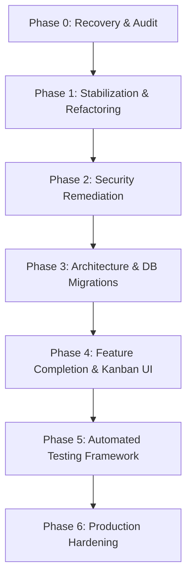

# PROJECT_RECOVERY.md — Codebase Recovery & Engineering Audit Report

**Project Name**: Smart Job Hunter (Hunter.io)  
**Audit Date**: August 31, 2026  
**Auditor**: Antigravity AI Engineering Team  
**Status**: Recovery & Audit Phase Complete (No application code modified)

---

## Executive Summary

Smart Job Hunter is an AI-assisted job matching and career acceleration web application built with a **React 18 (Vite) frontend** and a **FastAPI (Python) backend**. Development was paused several months ago. This audit establishes the true implementation state of the repository, separating verified code facts from README marketing claims.

The codebase is generally well-structured, functional in its core flows (auth, profile setup, PDF parsing, TF-IDF + skill matching, and application tracking), but suffers from **critical security vulnerabilities** (hardcoded JWT key, unauthenticated endpoints, unrestricted file upload), **architectural debt** (monolithic `main.py`, unmigrated DB, dead `resumes` table), and **inaccuracies in documentation** (claims 70/30 weighting but adds artificial multiplier boosts, claims Kanban UI but delivers a standard table, claims non-existent `app/routers/` files).

---

## 1. Actual System Architecture

### Frontend (React 18 + Vite)
- **Routing**: `react-router-dom` (v7) with client-side SPA routes: `/` (Landing), `/login`, `/register`, `/profile-setup`, `/dashboard`, `/matches`, `/tracker`, `/resume-hub`, `/settings`.
- **State & Auth**: `localStorage.getItem('token')` evaluated by `<ProtectedRoute>` HOC. Axios interceptor (`src/services/api.js`) appends Bearer header.
- **UI & UX**: Custom Tailwind CSS v3 dark mode with glassmorphism design system (`glass-card`, `btn-primary`), Framer Motion scroll animations, Lenis smooth scrolling, Lucide icons, and Spotlight hover cards (`SpotlightCard.jsx`).

### Backend (FastAPI + SQLAlchemy)
- **Framework**: FastAPI (Python 3.10+). Single entry point file (`backend/app/main.py`).
- **Database**: SQLite default (`job_hunter_v3.db`) via SQLAlchemy ORM.
- **Auth**: JWT HS256 algorithm using `python-jose` and `passlib` bcrypt hashing (with runtime monkeypatch for `bcrypt.__about__`).

### ML / NLP Engine
- **Text Extraction**: PyMuPDF (`fitz`) for PDF parsing, `docx2txt` for Word documents.
- **Skill Extraction**: Predefined tech dictionary (`TECH_SKILLS_DB`) + regex aliases (e.g. `"js"` -> `"javascript"`) + spaCy (`en_core_web_sm`) PROPN/NOUN entity extraction.
- **Match Calculation**: Cosine similarity via `scikit-learn` `TfidfVectorizer` combined with skill set intersection ratio.

---

## 2. Architecture & Data Flow Diagrams

### System Topology Diagram

```text
[ Browser Client ] (React 18 + Vite SPA)
       │
       │ HTTP / JSON API Requests (Vite Proxy: /api/* -> http://localhost:8000/*)
       ▼
┌─────────────────────────────────────────────────────────────┐
│ Fast API Backend Service (app/main.py)                      │
│                                                             │
│  ├── Middleware: CORS (Wildcard allow_origins=["*"])       │
│  ├── Security: JWT Verification (app/auth.py)               │
│  │                                                          │
│  ├── API Handlers:                                          │
│  │     ├── Auth: /register, /login, /me                    │
│  │     ├── Profile: /profile, /upload-resume                │
│  │     ├── Jobs: /jobs                                      │
│  │     ├── Matching: /match, /tailor-resume                 │
│  │     └── Tracker: /applications                           │
│  │                                                          │
│  └── Services Layer:                                        │
│        ├── MatchingEngine (TF-IDF + spaCy NLP)              │
│        ├── JobService (SQLAlchemy Query Builder)            │
│        ├── TailorService (Pattern-based Generator)          │
│        └── CoverLetterGenerator (Template Formatter)        │
└──────────────────────────────┬──────────────────────────────┘
                               │
            ┌──────────────────┴──────────────────┐
            ▼                                     ▼
┌─────────────────────────┐             ┌────────────────────┐
│ SQLite Database         │             │ Local File Storage │
│ (job_hunter_v3.db)      │             │ (backend/uploads/) │
│  ├── users              │             │  └── resume_*.pdf  │
│  ├── profiles           │             └────────────────────┘
│  ├── jobs               │
│  ├── application_tracker│
│  └── resumes (Unused)   │
└─────────────────────────┘
```

### Resume Upload & Matching Flow

```text
Resume Upload (PDF/TXT)
  │
  ▼
PyMuPDF / docx2txt Text Extraction
  │
  ▼
Saved to Profile (profile.resume_text)
  │
  ▼
Matching Engine Request (/match)
  ├───────────────────────────────┬───────────────────────────────┐
  ▼                               ▼                               ▼
Normalize Spaced Text        Skill Extraction             TF-IDF Cosine
& spaCy Lemmatization    (Dict DB + Aliases + PROPN)        Similarity
  │                               │                               │
  └───────────────────────────────┼───────────────────────────────┘
                                  ▼
                    Weighted Match Score Calculation
                (70% Skill Overlap + 30% Contextual Sim)
                                  │
                                  ▼
                      Non-linear Score Floor Boost
               final_score = max(score, similarity * 2)
                                  │
                                  ▼
                       Final Score (0 - 100%)
```

---

## 3. Feature Inventory

| Feature | Status | Evidence | Files | Notes |
| ------- | ------ | -------- | ----- | ----- |
| User Registration | WORKING | Tested endpoint `POST /register`, JWT returned, user stored with hashed password | `backend/app/main.py`, `backend/app/auth.py`, `frontend/src/pages/Register.jsx` | Functional auth flow |
| User Login | WORKING | Tested endpoint `POST /login`, validates bcrypt hash, returns JWT | `backend/app/main.py`, `backend/app/auth.py`, `frontend/src/pages/Login.jsx` | Uses OAuth2 password form |
| Profile Setup & Management | WORKING | `POST /profile`, `GET /me`, updates profile fields in SQLite | `backend/app/main.py`, `frontend/src/pages/ProfileSetup.jsx`, `frontend/src/pages/Settings.jsx` | Persists user target preferences |
| Resume PDF/TXT Extraction | WORKING | `POST /upload-resume`, uses PyMuPDF (`fitz`) and `docx2txt` | `backend/app/main.py`, `frontend/src/pages/ResumeHub.jsx` | Extracted text stored in `Profile` record |
| Hybrid AI Job Matching | WORKING | `POST /match`, calculates TF-IDF similarity + skill overlap | `backend/app/services/matching_engine.py`, `frontend/src/pages/Dashboard.jsx` | 70/30 weighting logic present with extra non-linear score boost |
| Gap Analysis & Skill Comparison | WORKING | `compare_skills()` returns matched vs missing skills and advice | `backend/app/services/matching_engine.py`, `frontend/src/pages/Dashboard.jsx` | Displays missing skills & advice cards |
| AI Resume Tailoring Suggestions | WORKING | `POST /tailor-resume`, pattern-based bullet point generator | `backend/app/services/tailor_service.py`, `frontend/src/components/TailorModal.jsx` | Heuristic template generator (not an LLM) |
| Application Tracker | WORKING | `GET/POST /applications`, tracks status (Applied, Interview, etc.) | `backend/app/models/models.py`, `backend/app/main.py`, `frontend/src/pages/Tracker.jsx` | Implemented as a data table, NOT a Kanban board |
| Job Search & Filtering | WORKING | `GET /jobs`, filters by location, remote status, experience, keywords | `backend/app/services/job_service.py`, `backend/app/main.py`, `frontend/src/pages/Dashboard.jsx` | Queries SQLite jobs table |
| Cover Letter Generation | IMPLEMENTED_BUT_UNUSED | `POST /generate-cover-letter` and `cover_letter.py` exist | `backend/app/services/cover_letter.py`, `backend/app/main.py`, `frontend/src/services/api.js` | Endpoint & service exist, but no UI in frontend connects to it |
| Kanban Board Visualization | NOT_IMPLEMENTED | Claimed in README | None | Tracker page is a standard HTML table |
| LLM API Integration (OpenAI/Anthropic) | NOT_IMPLEMENTED | Mentioned in comments | `backend/app/services/tailor_service.py` | Uses local hardcoded template string logic |
| Email Notifications | NOT_IMPLEMENTED | Mentioned in `road map.md` | None | No email service configured |

---

## 4. README Verification

| README Claim | Verified Status | Technical Findings in Code |
| ------------ | --------------- | -------------------------- |
| **70% Tech Skill Overlap + 30% Contextual Similarity** | **PARTIALLY_ACCURATE** | Code line `(skill_score * 0.7) + (content_similarity * 0.3)` matches ratio, BUT comment claims 60/40, AND code applies `max(final_score, content_similarity * 2)`, distorting genuine 70/30 weighting! |
| **Directory Structure (`app/routers/`, `matching_service.py`)** | **OUTDATED** | `app/routers/` does not exist (all routes in `main.py`). Service is `matching_engine.py`, not `matching_service.py`. Parser is embedded in `main.py`, not `resume_parser.py`. |
| **Kanban Pipeline Tracker** | **NOT_IMPLEMENTED** | Claimed as a Trello-style Kanban board. Actual implementation is a standard HTML `<table>` element. |
| **3D Visualizations** | **NOT_IMPLEMENTED** | Marketing claim. No 3D render libraries (Three.js, WebGL) exist in `package.json`. |
| **Automatic Tech Alias Handling ("JS" = "JavaScript")** | **ACCURATE** | Verified dictionary alias mapping in `matching_engine.py` (`"js"` -> `"javascript"`, `"postgres"` -> `"postgresql"`). |

---

## 5. Security Audit Findings

| ID | Severity | Category | Description | Target |
| -- | -------- | -------- | ----------- | ------ |
| SEC-01 | **CRITICAL** | Secrets Management | Secret key for signing JWT tokens is hardcoded as `"super-secret-key-change-me-in-production"` | `backend/app/auth.py` |
| SEC-02 | **HIGH** | Broken Authentication | `/match`, `/tailor-resume`, `/generate-cover-letter`, `/jobs` lack authentication | `backend/app/main.py` |
| SEC-03 | **HIGH** | Arbitrary File Upload | `/upload-resume` writes uploaded files directly to disk without extension restriction | `backend/app/main.py` |
| SEC-04 | **HIGH** | Insecure CORS | Wildcard origin `allow_origins=["*"]` configured with `allow_credentials=True` | `backend/app/main.py` |
| SEC-05 | **MEDIUM** | Password Hashing | `bcrypt.__about__` monkeypatch used due to `passlib` version mismatch | `backend/app/main.py` |
| SEC-06 | **MEDIUM** | Token Storage | JWT tokens stored unencrypted in browser `localStorage` | `frontend/src/services/api.js` |
| SEC-07 | **MEDIUM** | Denial of Service | No API rate limiting on authentication or CPU-intensive TF-IDF/spaCy parsing | `backend/app/main.py` |

---

## 6. Current Project State

- **FACT**: Core workflow (Register -> Login -> Profile -> Resume Upload -> Job Search -> Match Analysis -> Application Tracking) functions end-to-end.
- **FACT**: `resumes` table in SQLite DB is dead code / unused.
- **INFERENCE**: The project was developed as a rapid prototype / hackathon MVP with heavy focus on UI visuals and initial matching logic before development was paused.
- **UNKNOWN**: Production deployment target and database scaling strategy (PostgreSQL vs SQLite).

---

## 7. Recommended Recovery Roadmap



### Phase 0 — Recovery (COMPLETED)
- **Goal**: Understand codebase, reconstruct true architecture, create documentation.
- **Status**: Completed via this audit report and `.ai/` / `docs/` documentation system.

### Phase 1 — Stabilization & Modular Refactoring (Priority: HIGH)
- **Why**: Monolithic `main.py` (333 lines) mixes routes, models, text parsing, and startup logic. `bcrypt` requires runtime monkeypatching.
- **Problem Solved**: Code maintainability, prevents brittle runtime failures, separates concern layers.
- **Actions**:
  - Modularize `main.py` routes into `backend/app/routers/` (`auth.py`, `jobs.py`, `profile.py`, `matching.py`, `applications.py`).
  - Move `extract_text()` to dedicated service `backend/app/services/resume_parser.py`.
  - Fix `passlib` / `bcrypt` version conflict to eliminate monkeypatch.
- **Risk**: Low (structural refactoring only).

### Phase 2 — Security Remediation (Priority: CRITICAL)
- **Why**: Prevent token forgery, unauthenticated abuse, arbitrary file uploads, and CORS exploitation.
- **Problem Solved**: Closes critical and high security risks (SEC-01 through SEC-04).
- **Actions**:
  - Externalize `SECRET_KEY` into `.env` file via `pydantic-settings`.
  - Require JWT authentication (`Depends(get_current_user)`) on `/match`, `/tailor-resume`, `/generate-cover-letter`, and `/jobs`.
  - Enforce strict extension validation (`.pdf`, `.docx`, `.txt`) and mime-type checks on `/upload-resume`.
  - Update CORS configuration to whitelist specific origins instead of wildcard `*`.
- **Risk**: Low-medium (requires updated client headers for protected endpoints).

### Phase 3 — Database & Schema Cleanup (Priority: MEDIUM)
- **Why**: Database schema lacks migration tracking (Alembic) and contains dead tables (`resumes`).
- **Problem Solved**: Data integrity, schema evolution safety, database performance.
- **Actions**:
  - Initialize Alembic migration scripts.
  - Remove dead `resumes` ORM model or integrate it properly for historical resume versioning.
  - Add missing composite index on `application_tracker(user_id, job_id)`.
- **Risk**: Low.

### Phase 4 — Feature Completion (Priority: MEDIUM)
- **Why**: Align actual implementation with README promises and complete unfinished UI elements.
- **Problem Solved**: Delivers advertised Kanban board and connects orphaned Cover Letter endpoint.
- **Actions**:
  - Implement a drag-and-drop Kanban view option on `/tracker` using `@hello-pangea/dnd` or HTML5 Drag and Drop.
  - Add Cover Letter Generator modal component to frontend using existing `POST /generate-cover-letter` endpoint.
  - Normalize matching score formula to strictly adhere to 70/30 weighting without arbitrary floor boosts.
- **Risk**: Low.

### Phase 5 — Automated Testing (Priority: HIGH)
- **Why**: Current repository has 0 automated tests.
- **Problem Solved**: Prevents regressions during future feature work.
- **Actions**:
  - Install `pytest` and `httpx` for backend unit and API testing.
  - Add unit tests for `MatchingEngine`, `JobService`, and authentication routes.
  - Setup frontend test runner (`vitest`).
- **Risk**: None (purely additive).

### Phase 6 — Production Hardening (Priority: LOW)
- **Why**: Prepare application for multi-user deployment.
- **Problem Solved**: Scalability, rate-limiting, production deployment.
- **Actions**:
  - Configure PostgreSQL database support.
  - Implement slowapi / redis rate limiting.
  - Dockerize backend and frontend with multi-stage `Dockerfile`.
- **Risk**: Medium.
