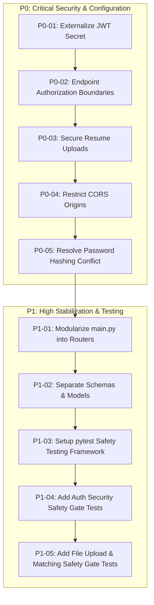

# ROADMAP.md — Implementation-Ready Engineering Task Plan

This document contains the implementation-ready task breakdown for **Smart Job Hunter**. All tasks are prioritized using **P0 (Critical Security & Configuration)**, **P1 (High Stabilization & Refactoring)**, **P2 (Medium Feature & Schema Polish)**, and **P3 (Low Production Hardening)**.

---

## Task Priority Overview

---

## Detailed Task Breakdown

### P0-01 — Externalize JWT Secret

- **Objective**: Remove hardcoded JWT signing key and load it dynamically from environment variables.
- **Files Likely Affected**: `backend/app/auth.py`, `backend/app/core/config.py` (NEW), `backend/.env.example` (NEW).
- **Preconditions**: None.
- **Implementation Requirements**:
  - Create `app/core/config.py` using Pydantic `BaseSettings`.
  - Load `SECRET_KEY` from `os.getenv("SECRET_KEY")`.
  - Enforce minimum length check (32+ chars) and raise runtime error if unconfigured in non-dev environment.
- **Security Considerations**: Ensures JWT tokens cannot be forged by reading repository source code.
- **Tests Required**: Unit test validating application fails to sign tokens if `SECRET_KEY` is missing/empty.
- **Acceptance Criteria**:
  - Zero hardcoded JWT secret strings in source code.
  - `SECRET_KEY` successfully loaded from `.env`.
  - Registration and login tokens sign and verify correctly.
- **Dependencies**: None.
- **Risk**: Low.

---

### P0-02 — Endpoint Authorization Boundaries

- **Objective**: Protect computational endpoints `/match`, `/tailor-resume`, `/generate-cover-letter` with JWT authentication while retaining `GET /jobs` as public discovery.
- **Files Likely Affected**: `backend/app/main.py` (or `app/routers/matching.py`, `app/routers/jobs.py`).
- **Preconditions**: P0-01 completed.
- **Implementation Requirements**:
  - Add `current_user: User = Depends(get_current_user)` to `@app.post("/match")`, `@app.post("/tailor-resume")`, and `@app.post("/generate-cover-letter")`.
  - Retain `@app.get("/jobs")` as an unauthenticated `PUBLIC` endpoint for job discovery.
- **Security Considerations**: Prevents anonymous users from executing CPU-intensive TF-IDF vectorization and spaCy NLP entity extraction.
- **Tests Required**: Integration test asserting HTTP 401 Unauthorized when querying `/match` without Bearer token.
- **Acceptance Criteria**:
  - Unauthenticated requests to `/match`, `/tailor-resume`, and `/generate-cover-letter` return `401 Unauthorized`.
  - Authenticated requests with valid Bearer tokens process successfully.
  - `GET /jobs` remains accessible without authentication.
- **Dependencies**: P0-01.
- **Risk**: Low.

---

### P0-03 — Secure Resume Upload Boundary

- **Objective**: Enforce strict 10-layer security boundary on `POST /upload-resume`.
- **Files Likely Affected**: `backend/app/main.py` (or `app/routers/profile.py`), `backend/app/utils/file_handling.py` (NEW).
- **Preconditions**: P0-01.
- **Implementation Requirements**:
  - Create `app/utils/file_handling.py` to validate extensions (`.pdf`, `.docx`, `.txt`), magic bytes (`%PDF-`, `PK\x03\x04`), and 10MB size limit.
  - Save files using server-generated UUIDs (`uploads/resume_{user_id}_{uuid.hex}{ext}`).
  - Wrap `extract_text()` in `try...except` handling for malformed/encrypted PDF fallback (`400 Bad Request`).
  - Delete older user resume files upon new upload.
- **Security Considerations**: Prevents arbitrary code execution, disk exhaustion, path traversal, and document parsing crashes.
- **Tests Required**: Tests attempting upload of `.exe` files, oversized files (>10MB), and corrupt PDFs.
- **Acceptance Criteria**:
  - Non-whitelisted extensions rejected with `400 Bad Request`.
  - Original filenames replaced with secure server UUIDs.
  - Malformed documents fail gracefully with informative error messages.
- **Dependencies**: P0-01.
- **Risk**: Low.

---

### P0-04 — Restrict CORS Origins

- **Objective**: Eliminate wildcard origin (`*`) with credentials enabled.
- **Files Likely Affected**: `backend/app/main.py`, `backend/app/core/config.py`.
- **Preconditions**: P0-01.
- **Implementation Requirements**:
  - Update `CORSMiddleware` in `main.py` to use `allow_origins=settings.ALLOWED_ORIGINS` (defaulting to `["http://localhost:5173", "http://localhost:3000"]`).
- **Security Considerations**: Mitigates cross-origin data theft and unauthorized browser API access.
- **Tests Required**: Preflight `OPTIONS` request test checking allowed vs rejected origins.
- **Acceptance Criteria**:
  - Allowed origin `http://localhost:5173` returns appropriate CORS headers.
  - Unauthorized origins rejected by browser preflight.
- **Dependencies**: P0-01.
- **Risk**: Low.

---

### P0-05 — Resolve Password Hashing Dependency Conflict

- **Objective**: Eliminate runtime monkeypatch `bcrypt.__about__` in `main.py`.
- **Files Likely Affected**: `backend/app/main.py`, `backend/requirements.txt`, `backend/app/auth.py`.
- **Preconditions**: None.
- **Implementation Requirements**:
  - Update `requirements.txt` to pin compatible `passlib` (1.7.4) and `bcrypt` (4.0.1) or migrate to `argon2-cffi`.
  - Remove runtime monkeypatch lines 7–9 in `main.py`.
- **Security Considerations**: Eliminates fragile runtime monkeypatching in authentication layer.
- **Tests Required**: Password hashing and verification unit tests.
- **Acceptance Criteria**:
  - Application starts clean without monkeypatching `bcrypt`.
  - Password registration and login verification pass.
- **Dependencies**: None.
- **Risk**: Low.

---

### P1-01 — Modularize `main.py` into FastAPI Routers

- **Objective**: Split monolithic `main.py` (333 lines) into domain routers.
- **Files Likely Affected**: `backend/app/main.py`, `backend/app/routers/` (`auth.py`, `profile.py`, `jobs.py`, `matching.py`, `applications.py`).
- **Preconditions**: P0 tasks completed and safety gate tests passing.
- **Implementation Requirements**:
  - Create router modules in `app/routers/`.
  - Move endpoint handlers from `main.py` to corresponding routers.
  - Include routers in `main.py` via `app.include_router()`.
- **Security Considerations**: Retain all authorization dependencies on protected routes.
- **Tests Required**: Full API integration safety gate test suite.
- **Acceptance Criteria**:
  - `main.py` reduced to under 50 lines (app factory + middleware).
  - All 12 API endpoints function with zero broken route contracts.
- **Dependencies**: P0-01 through P0-05, P1-03.
- **Risk**: Medium.

---

### P1-02 — Separate Schemas & Models

- **Objective**: Separate Pydantic DTO validation schemas and SQLAlchemy ORM models into dedicated packages.
- **Files Likely Affected**: `backend/app/models/` (`user.py`, `job.py`, `application.py`), `backend/app/schemas/` (`auth.py`, `profile.py`, `job.py`, `matching.py`, `application.py`).
- **Preconditions**: P1-01.
- **Implementation Requirements**:
  - Split `app/models/models.py` into individual domain models under `app/models/`.
  - Move inline Pydantic models from `main.py` to `app/schemas/`.
- **Security Considerations**: Enforce string lengths and type validation on all Pydantic schemas.
- **Tests Required**: Schema validation unit tests.
- **Acceptance Criteria**:
  - Clean separation between ORM models and validation DTOs.
  - Imports updated across all service layers.
- **Dependencies**: P1-01.
- **Risk**: Medium.

---

### P1-03 — Setup `pytest` Safety Testing Framework

- **Objective**: Build automated unit and API integration testing suite.
- **Files Likely Affected**: `backend/tests/` (`conftest.py`, `unit/`, `integration/`).
- **Preconditions**: P0 tasks.
- **Implementation Requirements**:
  - Create `conftest.py` with in-memory SQLite database session fixtures and FastAPI TestClient / HTTPX fixtures.
  - Create test structure under `backend/tests/`.
- **Security Considerations**: Ensure tests run in isolated test database environment.
- **Tests Required**: Execution of `pytest` demonstrating passing suite.
- **Acceptance Criteria**:
  - `pytest` executes cleanly and outputs coverage report.
- **Dependencies**: P0 tasks.
- **Risk**: Low.
