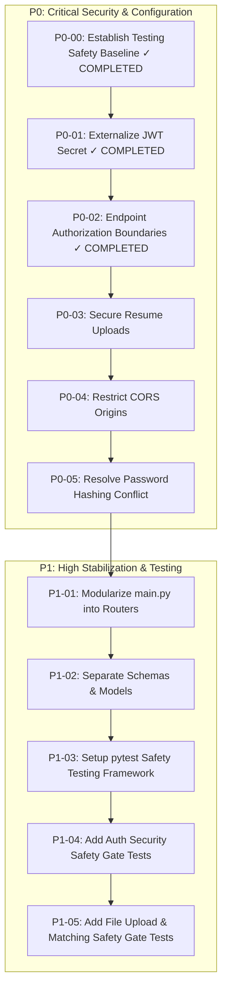

# ROADMAP.md — Implementation-Ready Engineering Task Plan

This document contains the implementation-ready task breakdown for **Smart Job Hunter**. All tasks are prioritized using **P0 (Critical Security & Configuration)**, **P1 (High Stabilization & Refactoring)**, **P2 (Medium Feature & Schema Polish)**, and **P3 (Low Production Hardening)**.

---

## Task Priority Overview

---

## Completed Tasks

### P0-00 — Establish Testing Safety Baseline (✓ COMPLETED)
- **Objective**: Build a 100% isolated, deterministic pytest safety baseline capturing current application behavior and vulnerability baselines before refactoring.
- **Result**: **35 / 35 tests passing**. Data isolation enforced via `sqlite:///:memory:` with SQLAlchemy `StaticPool`.
- **Baseline Report**: [docs/TEST_BASELINE.md](file:///home/blueberyy/Documents/SJ/Smart-Job-Hunter/docs/TEST_BASELINE.md).

### P0-01 — Externalize JWT Secret (✓ COMPLETED)
- **Objective**: Externalize hardcoded JWT secret from `app/auth.py` to centralized settings model `app/core/config.py` loaded from environment variables.
- **Result**: Hardcoded secret string completely purged. Centralized settings implemented with fail-safe production validation. 39 / 39 tests passing.

### P0-02 — Endpoint Authorization Boundaries (✓ COMPLETED)
- **Objective**: Protect computational endpoints `/match`, `/tailor-resume`, `/generate-cover-letter` with JWT authentication (`Depends(get_current_user)`) while retaining `GET /jobs` as public discovery.
- **Result**: Protected all three computational endpoints with JWT authentication dependencies. 46 / 46 tests passing.

---

## Detailed Pending Task Breakdown

### P0-03 — Secure Resume Upload Boundary

- **Objective**: Enforce strict 10-layer security boundary on `POST /upload-resume`.
- **Files Likely Affected**: `backend/app/main.py` (or `app/routers/profile.py`), `backend/app/utils/file_handling.py` (NEW).
- **Preconditions**: P0-00, P0-01, P0-02 completed.
- **Implementation Requirements**:
  - Create `app/utils/file_handling.py` to validate extensions (`.pdf`, `.docx`, `.txt`), magic bytes (`%PDF-`, `PK\x03\x04`), and 10MB size limit.
  - Save files using server-generated UUIDs (`uploads/resume_{user_id}_{uuid.hex}{ext}`).
  - Wrap `extract_text()` in `try...except` handling for malformed/encrypted PDF fallback (`400 Bad Request`).
  - Delete older user resume files upon new upload.
- **Security Considerations**: Prevents arbitrary code execution, disk exhaustion, path traversal, and document parsing crashes.
- **Tests Required**: Tests attempting upload of `.exe` files, oversized files (>10MB), and corrupt PDFs.
- **Acceptance Criteria**:
  - Non-whitelisted extensions rejected with `400 Bad Request`.
  - Original filenames replaced with secure server UUIDs.
  - Malformed documents fail gracefully with informative error messages.
- **Dependencies**: P0-00, P0-01, P0-02.
- **Risk**: Low.

---

### P0-04 — Restrict CORS Origins

- **Objective**: Eliminate wildcard origin (`*`) with credentials enabled.
- **Files Likely Affected**: `backend/app/main.py`, `backend/app/core/config.py`.
- **Preconditions**: P0-00, P0-01, P0-02.
- **Implementation Requirements**:
  - Update `CORSMiddleware` in `main.py` to use `allow_origins=settings.ALLOWED_ORIGINS` (defaulting to `["http://localhost:5173", "http://localhost:3000"]`).
- **Security Considerations**: Mitigates cross-origin data theft and unauthorized browser API access.
- **Tests Required**: Preflight `OPTIONS` request test checking allowed vs rejected origins.
- **Acceptance Criteria**:
  - Allowed origin `http://localhost:5173` returns appropriate CORS headers.
  - Unauthorized origins rejected by browser preflight.
- **Dependencies**: P0-00, P0-01, P0-02.
- **Risk**: Low.

---

### P0-05 — Resolve Password Hashing Dependency Conflict

- **Objective**: Eliminate runtime monkeypatch `bcrypt.__about__` in `main.py`.
- **Files Likely Affected**: `backend/app/main.py`, `backend/requirements.txt`, `backend/app/auth.py`.
- **Preconditions**: P0-00, P0-01, P0-02.
- **Implementation Requirements**:
  - Update `requirements.txt` to pin compatible `passlib` (1.7.4) and `bcrypt` (4.0.1) or migrate to `argon2-cffi`.
  - Remove runtime monkeypatch lines 7–9 in `main.py`.
- **Security Considerations**: Eliminates fragile runtime monkeypatching in authentication layer.
- **Tests Required**: Password hashing and verification unit tests.
- **Acceptance Criteria**:
  - Application starts clean without monkeypatching `bcrypt`.
  - Password registration and login verification pass.
- **Dependencies**: P0-00, P0-01, P0-02.
- **Risk**: Low.
