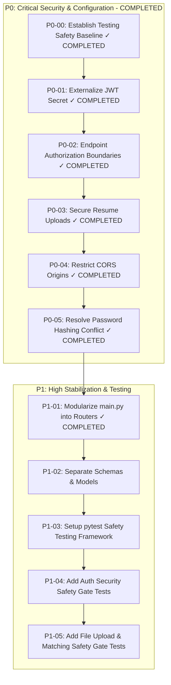

# ROADMAP.md — Implementation-Ready Engineering Task Plan

This document contains the implementation-ready task breakdown for **Smart Job Hunter**. All tasks are prioritized using **P0 (Critical Security & Configuration)**, **P1 (High Stabilization & Refactoring)**, **P2 (Medium Feature & Schema Polish)**, and **P3 (Low Production Hardening)**.

---

## Task Priority Overview

---

## Completed Tasks

### P0-00 — Establish Testing Safety Baseline (✓ COMPLETED)
- **Objective**: Build a 100% isolated, deterministic pytest safety baseline capturing current application behavior and vulnerability baselines before refactoring.
- **Result**: **35 / 35 tests passing**.

### P0-01 — Externalize JWT Secret (✓ COMPLETED)
- **Objective**: Externalize hardcoded JWT secret from `app/auth.py` to centralized settings model `app/core/config.py` loaded from environment variables.
- **Result**: Hardcoded secret string completely purged. 39 / 39 tests passing.

### P0-02 — Endpoint Authorization Boundaries (✓ COMPLETED)
- **Objective**: Protect computational endpoints `/match`, `/tailor-resume`, `/generate-cover-letter` with JWT authentication (`Depends(get_current_user)`).
- **Result**: Protected all three computational endpoints. 46 / 46 tests passing.

### P0-03 — Secure Resume Upload Boundary (✓ COMPLETED)
- **Objective**: Enforce strict 10-layer security boundary on `POST /upload-resume` (extension whitelisting, MIME magic header verification, 10MB size limit, server UUID filenames, old file lifecycle cleanup).
- **Result**: Implemented `app/utils/file_handling.py` and updated `upload_resume`. Rewrote root `README.md`. 50 / 50 tests passing.

### P0-04 — Restrict CORS Origins (✓ COMPLETED)
- **Objective**: Eliminate wildcard origin (`*`) with credentials enabled in `CORSMiddleware`.
- **Result**: Restricted allowed origins to environment-configurable `settings.ALLOWED_ORIGINS`. Added `backend/tests/test_cors.py`. 55 / 55 tests passing.

### P0-05 — Resolve Password Hashing Conflict (✓ COMPLETED)
- **Objective**: Eliminate runtime monkeypatch `bcrypt.__about__` in `main.py` and pin compatible authentication packages (`passlib==1.7.4`, `bcrypt==4.0.1`).
- **Result**: Removed monkeypatch completely from `app/main.py`. 58 / 58 tests passing.

### P1-01 — Modularize main.py into Routers (✓ COMPLETED)
- **Objective**: Structural refactoring of monolithic `main.py` (346 lines → 36 lines) into 5 dedicated FastAPI APIRouters under `app/routers/`.
- **Result**: Created `routers/auth.py`, `routers/jobs.py`, `routers/matching.py`, `routers/profile.py`, and `routers/applications.py`. **58 / 58 tests passing**. Zero side effects.

---

## Detailed Pending Task Breakdown (Phase 1)

### P1-02 — Separate Schemas & Models

- **Objective**: Extract inline Pydantic models from routers into a centralized `app/schemas/` directory (`user.py`, `job.py`, `profile.py`, `application.py`).
- **Files Likely Affected**: `backend/app/schemas/` (NEW), `backend/app/routers/`.
- **Preconditions**: P1-01 completed.
- **Dependencies**: P1-01 completed.
- **Risk**: Low.
