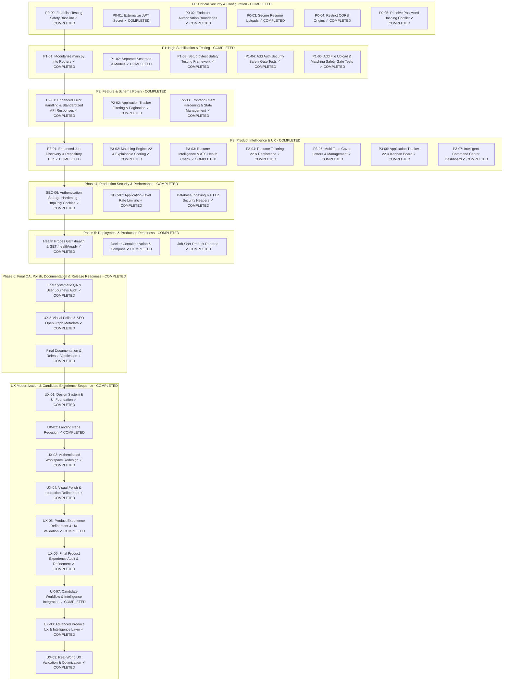

# ROADMAP.md — Implementation-Ready Engineering Task Plan

This document contains the implementation-ready task breakdown for **Job Seer**. All tasks across Phase 0 through Phase 6 and UX-01 through UX-09 are officially **COMPLETED**.

---

## Task Priority Overview

---

## Completed Roadmap Summary

- **Phase 0 — Security & Baseline**: COMPLETED ✅
- **Phase 1 — Stabilization & Architectural Refactoring**: COMPLETED ✅
- **Phase 2 — API & Frontend Engineering Improvements**: COMPLETED ✅
- **Phase 3 — Core Product Intelligence & UX**: COMPLETED ✅
- **Phase 4 — Production Security & Performance**: COMPLETED ✅
- **Phase 5 — Deployment & Production Readiness**: COMPLETED ✅
- **Phase 6 — Final QA, Polish, Documentation & Release Readiness**: COMPLETED ✅
- **UX-01 — Design System & UI Foundation**: COMPLETED ✅
- **UX-02 — Landing Page Redesign**: COMPLETED ✅
- **UX-03 — Authenticated Workspace Redesign**: COMPLETED ✅
- **UX-04 — Visual Polish & Interaction Refinement**: COMPLETED ✅
- **UX-05 — Product Experience Refinement & UX Validation**: COMPLETED ✅
- **UX-06 — Final Product Experience Audit & Refinement**: COMPLETED ✅
- **UX-07 — Candidate Workflow & Intelligence Integration**: COMPLETED ✅
- **UX-08 — Advanced Product UX & Intelligence Layer**: COMPLETED ✅
- **UX-09 — Real-World UX Validation & Optimization**: COMPLETED ✅
