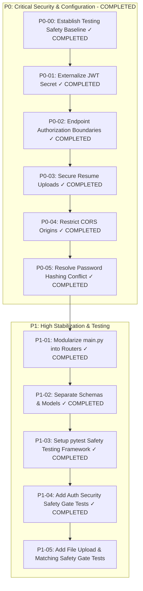

# ROADMAP.md — Implementation-Ready Engineering Task Plan

This document contains the implementation-ready task breakdown for **Smart Job Hunter**. All tasks are prioritized using **P0 (Critical Security & Configuration)**, **P1 (High Stabilization & Refactoring)**, **P2 (Medium Feature & Schema Polish)**, and **P3 (Low Production Hardening)**.

---

## Task Priority Overview

---

## Completed Tasks

### P0-00 — Establish Testing Safety Baseline (✓ COMPLETED)
- **Result**: **35 / 35 tests passing**.

### P0-01 — Externalize JWT Secret (✓ COMPLETED)
- **Result**: Hardcoded secret string completely purged. Centralized settings implemented with fail-safe production validation. 39 / 39 tests passing.

### P0-02 — Endpoint Authorization Boundaries (✓ COMPLETED)
- **Result**: Protected all three computational endpoints with JWT authentication dependencies. 46 / 46 tests passing.

### P0-03 — Secure Resume Upload Boundary (✓ COMPLETED)
- **Result**: Implemented `app/utils/file_handling.py` and updated `upload_resume`. Rewrote root `README.md`. 50 / 50 tests passing.

### P0-04 — Restrict CORS Origins (✓ COMPLETED)
- **Result**: Restricted allowed origins to environment-configurable `settings.ALLOWED_ORIGINS`. Added `backend/tests/test_cors.py`. 55 / 55 tests passing.

### P0-05 — Resolve Password Hashing Conflict (✓ COMPLETED)
- **Result**: Removed monkeypatch completely from `app/main.py`. Pinned `passlib==1.7.4` and `bcrypt==4.0.1`. 58 / 58 tests passing.

### P1-01 — Modularize main.py into Routers (✓ COMPLETED)
- **Result**: Structural refactoring of monolithic `main.py` into 5 APIRouters. 58 / 58 tests passing.

### P1-02 — Separate Schemas & Models (✓ COMPLETED)
- **Result**: Extracted Pydantic DTO models into `app/schemas/`. 58 / 58 tests passing.

### P1-03 — Setup pytest Safety Testing Framework (✓ COMPLETED)
- **Result**: Configured `pyproject.toml` with `pytest-cov` (88% code coverage baseline), strict test markers (`unit`, `integration`, `security`, `regression`), and reduced warnings from 75 to 1. 58 / 58 tests passing.

### P1-04 — Add Auth Security Safety Gate Tests (✓ COMPLETED)
- **Result**: Implemented 13 dedicated JWT authentication safety gate tests covering token expiration, payload tampering, invalid signatures, missing claims, nonexistent users, invalid schemes, and algorithm enforcement. Increased code coverage to **89%** (with **100% coverage on `app/auth.py`**). **71 / 71 tests passing**.

---

## Detailed Pending Task Breakdown (Phase 1)

### P1-05 — Add File Upload & Matching Safety Gate Tests

- **Objective**: Add edge-case safety tests for file upload mime validation, path traversal attempts, malformed PDFs, empty files, and matching engine edge cases.
- **Files Likely Affected**: `backend/tests/test_uploads.py`, `backend/tests/test_matching.py`.
- **Preconditions**: P1-01 through P1-04 completed.
- **Risk**: Low.
