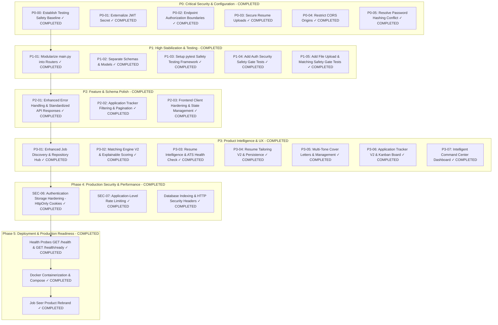

# ROADMAP.md — Implementation-Ready Engineering Task Plan

This document contains the implementation-ready task breakdown for **Job Seer**. All tasks are prioritized using **P0 (Critical Security & Configuration)**, **P1 (High Stabilization & Refactoring)**, **P2 (Medium Feature & Schema Polish)**, **P3 (Product Intelligence & UX)**, **Phase 4 (Production Security & Performance)**, and **Phase 5 (Deployment & Production Readiness)**.

---

## Task Priority Overview

---

## Completed Phases

### Phase 0 through Phase 4 (✓ ALL COMPLETED)

### Phase 5 — Deployment & Production Readiness (✓ COMPLETED)
- **Result**: Rebranded product to **Job Seer** (*Your intelligent job search companion*), created health check liveness (`GET /health`) and readiness (`GET /health/ready`) probes in `app/routers/health.py`, created production `Dockerfile`, `.dockerignore`, `docker-compose.yml`, environment variable template `.env.example`, and deployment guide in `docs/DEPLOYMENT.md`. Added 5 integration tests in `backend/tests/test_phase5_production_readiness.py`. **171 / 171 backend pytest cases passing** (91% coverage), **90 security tests passing**, **6 / 6 frontend unit tests passing**, production Vite build succeeded cleanly.
